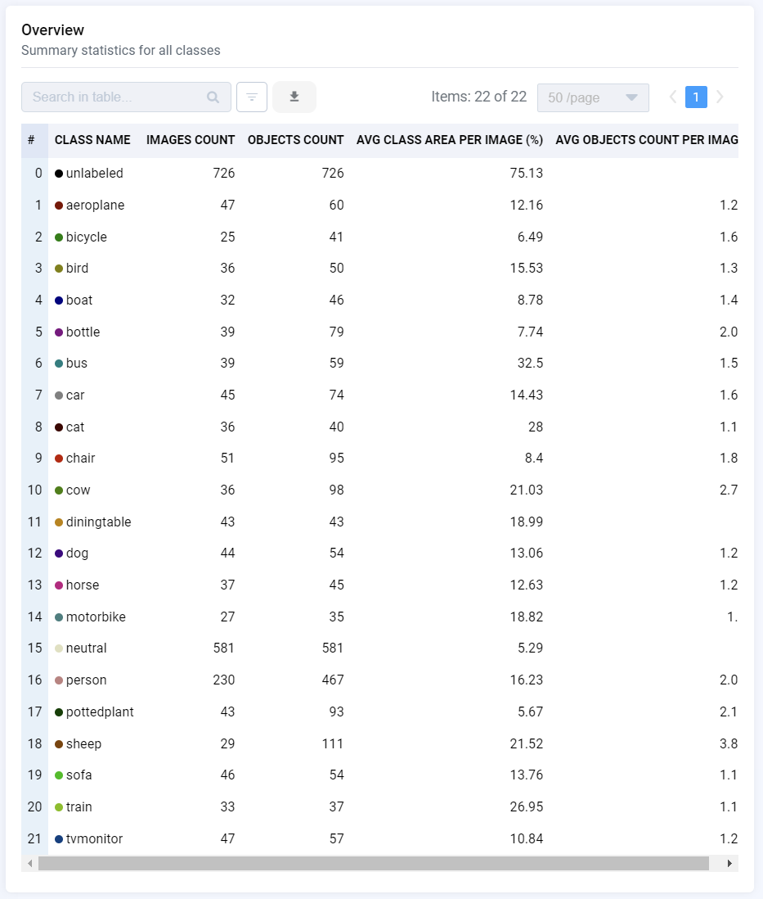

 

  

 

# PascalVOC Ground Truth Masks (Sample)

  <a href="#overview">Overview</a> •
  <a href="#download">Download</a> •
  <a href="#statistics">Statistics</a> •
  <a href="#examples">Examples</a>

 

## Overview 

`pascal_sample_gt_masks` is a sample project with the total of 726 images from PascalVOC and 4 datasets: `train`, `val`, `test` (and mixed `trainval`) subsets.

## Download

Direct download: [zip archive](https://cloud.enterprise.supervise.ly/f/906665) (65,7 MB).

## Statistics

Project contains 4 datasets with 726 images in it, with a total of 2219 annotated objects. 

## Examples

  
